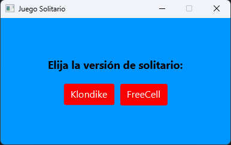
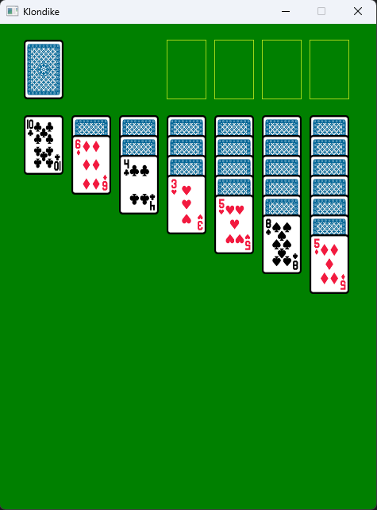
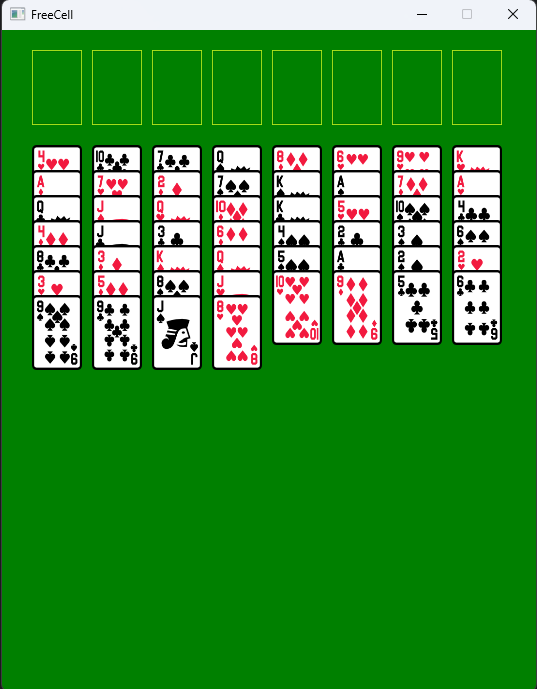

# Solitaire Game Project

## Overview

This repository contains the main project developed in the subject "Programming Paradigms" at the Faculty of Engineering, University of Buenos Aires (UBA). The aim of this project is to create a video game that provides players with the opportunity to experience various solitaire variations. By the end of the development process, users will be able to engage in at least two distinct solitaire variants.

## Key Concepts Explored

Throughout the development of this project, we explored several key concepts within the realm of programming paradigms. These concepts include:

- **Object-Oriented Programming (OOP):** The project heavily relies on the principles of object-oriented programming to structure and organize code efficiently.

- **Design Principles and Patterns:** We have applied fundamental design principles and design patterns to ensure a scalable, maintainable, and modular codebase (MVC).

- **Testing:** The importance of testing in software development is emphasized, and the project includes comprehensive testing practices to ensure robust and bug-free code.

- **Graphic Interfaces:** The game features a graphical user interface (GUI) to enhance the user experience, and the development process includes considerations for effective UI/UX design.

## Images

  
   
  <em>Image of the program presentation.</em>

  
   
  <em>Image of a Klondike game.</em>

  
   
  <em>Image of a FreeCell game.</em>

